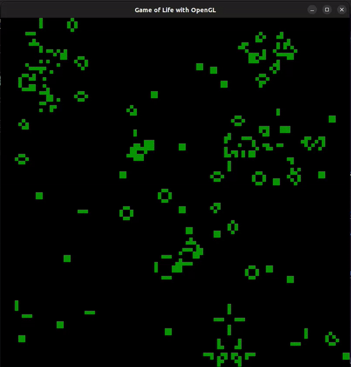
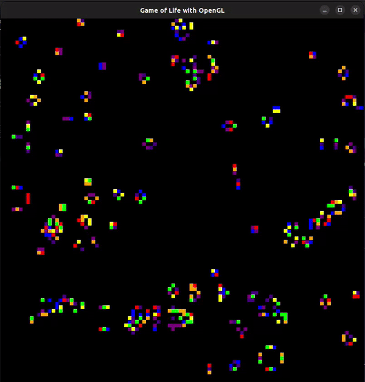

# Game of Life with C++ and OpenGL

## Overview

This project implements Conway's Game of Life using C++ and OpenGL for visualization. Conway's Game of Life is a cellular automaton devised by mathematician John Conway. The game is played on a grid where cells can be either alive or dead, and their states evolve based on a set of rules.

## Rules

The simulation follows these rules to determine the next state of each cell:

1. **Underpopulation**: Any live cell with fewer than two live neighbors dies.
2. **Survival**: Any live cell with two or three live neighbors lives on to the next generation.
3. **Overpopulation**: Any live cell with more than three live neighbors dies.
4. **Reproduction**: Any dead cell with exactly three live neighbors becomes a live cell.

## Prerequisites

Before running the simulation, ensure you have the following prerequisites installed:

- C++ compiler (e.g., g++, clang++)
- OpenGL library
- GLUT (OpenGL Utility Toolkit)

## Build and Run

Follow these steps to compile and run the simulation:

1. **Clone the Repository:**
    ```bash
    git clone https://github.com/Gsharp73/Game-of-Life.git
    cd Game-of-Life
    ```

2. **Compile the Code:**
    ```bash
    g++ -o game_of_life gui_GOL.cpp -lGL -lGLU -lglut
    ```

3. **Run the Simulation:**
    ```bash
    ./game_of_life
    ```

## Screenshots

Below are some visual examples of the Game of Life simulation in action:

<div style="display: flex; justify-content: center; gap: 40px;">
  
  
</div>


